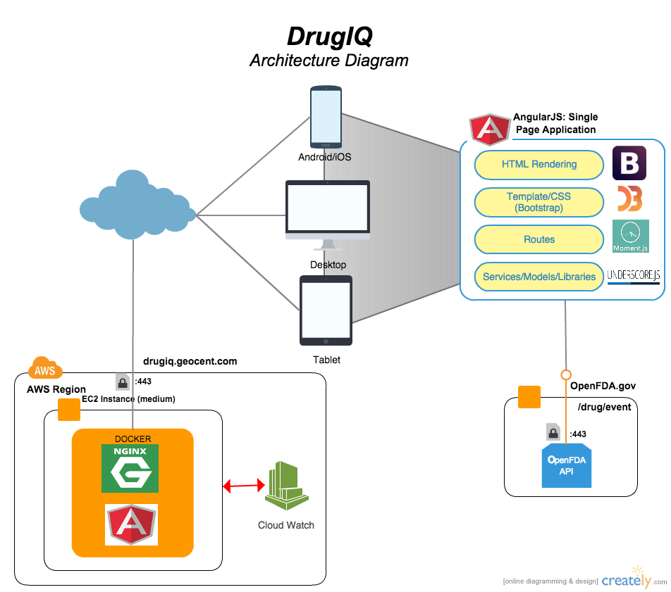
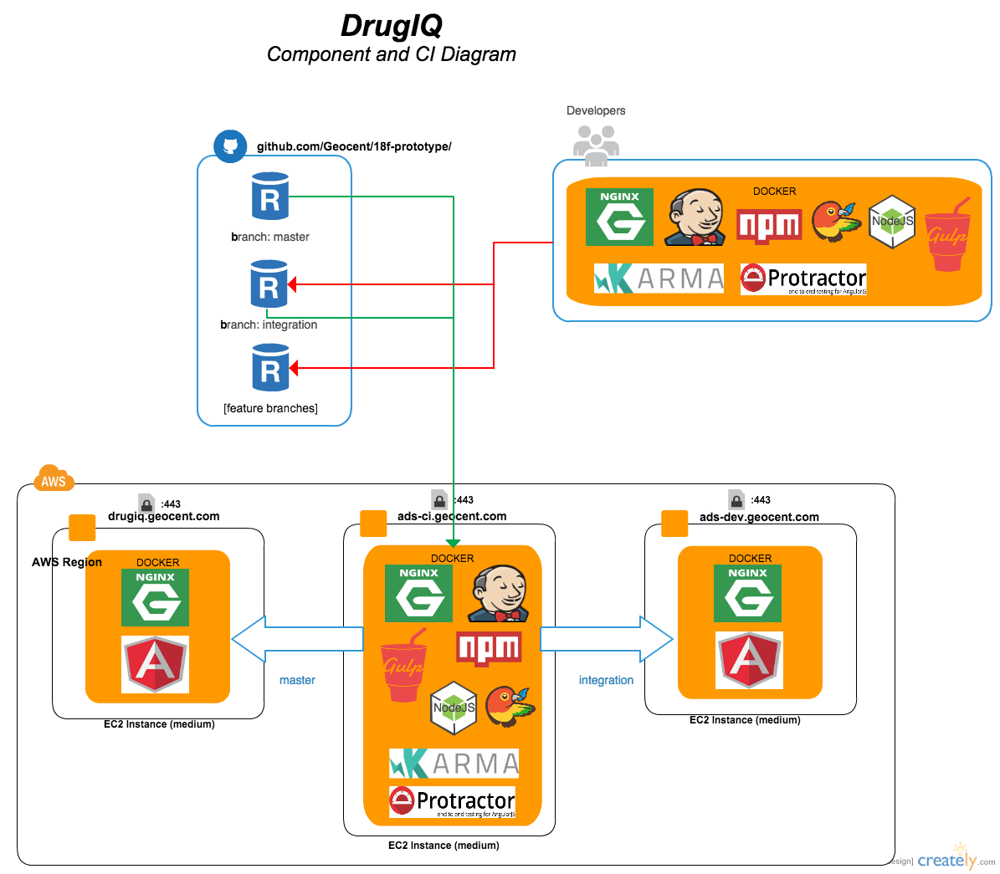

# ADS Prototype Response

| Purpose | Server/Site | Status |
| ------------------- | ------------- | ------------- |
| Production Deployment | https://drugiq.geocent.com |  |
| Development Deployment | https://ads-dev.geocent.com |  |
| Development Build Status | https://ads-ci.geocent.com/job/build-dev/ |  |
| Unit Test | https://ads-ci.geocent.com/job/build-dev/lastCompletedBuild/testReport/ |  |
| Coverage Results | https://ads-ci.geocent.com/job/build-dev/cobertura/ |  |
| Integration Tests | https://ads-ci.geocent.com/job/functional-dev/ |  |
| CI/Jenkins | https://ads-ci.geocent.com |  |
| Scrum Mgt | https://www.scrumdo.com/projects/project/18f-ads-prototype/ |  |

## Description:

Write a brief description, no greater than 750 words, of the approach used to create the working prototype and place this description in the README.md file located in the root directory of your repository.
Pool One Design: In addition to the Description, above, the Quoter must demonstrate that they followed the U.S. Digital Services Playbook by providing evidence in the repository. The README.md file should also make reference to the following for Pool One design:

## Architecture Diagram

## Continuous Integration Diagram

### Design Standards:
* [US Digital Services Playbook](https://playbook.cio.gov/#play3)
* 508 Compliance
* Google Accessibility: http://www.google.com/accessibility/initiatives-research.html

### UI Tools and Techniques
* Style Guide [Bootswatch: Yeti] (https://bootswatch.com/yeti/)
* [Playbook Checklist](/docs/HCD/USG%20Playbook%20Checklist.xlsx)
* [Paper Prototype Usability Test Metrics and Results](./docs/ADS-Usability%20Test-Metrics_final.xlsx)
* [Latest Desktop and Mobile Mockups](docs/HCD/ADS-ThirdDraftMockup-with%20Mobile.pdf)
* [508 Compliance Audit](./docs/HCD/508_Compliance_Audit.xlsx)

### Technologies Used:
| Modern Technology  |    Purpose    |    License    |
| ------------------- | ------------- | ------------- |
| [AngularJS] (https://angularjs.org/)  | JS/UI Framework  | [MIT] (https://github.com/angular/angular.js/blob/master/LICENSE)  |
| [Docker] (https://www.docker.com/) | Production Deployment Contain for isolation  | [Apache] (https://github.com/docker/docker/blob/master/LICENSE)  |
| [Bootstrap] (http://getbootstrap.com/) | Responsive UI  | [MIT] (https://github.com/twbs/bootstrap/blob/master/LICENSE)  |
| [Gulp] (http://gulpjs.com/)  | Automated Build/Workflow  | [MIT] (https://github.com/gulpjs/gulp/blob/master/LICENSE)  |
| [Karma] (http://karma-runner.github.io/0.8/plus/AngularJS.html)  | Unit Testing  | [MIT] (https://github.com/karma-runner/karma/blob/master/LICENSE)  |
| [Protractor] (https://angular.github.io/protractor/#/)  | E2E Testing  | [MIT] (https://github.com/angular/protractor/blob/master/LICENSE)  |
| [NVM] (https://github.com/creationix/nvm)  | Node Versioning Manager for local Devleopment Environment  | [MIT] (https://github.com/creationix/nvm/blob/master/LICENSE.md)  |
| [D3 JS] (http://d3js.org/) | Used for charts and data driven documents | [AS IS] (https://github.com/mbostock/d3/blob/master/LICENSE) |
| [NVD3] (http://nvd3.org/) | Reusable charts component for D3 | [Apache] (https://github.com/novus/nvd3/blob/master/LICENSE.md) |
| [Angular-nvD3] (http://krispo.github.io/angular-nvd3/#/) | An AngularJS directive for NVD3 re-usable charting library | [MIT] (https://github.com/krispo/angular-nvd3/blob/master/LICENSE) |
| [Moment.js] (http://momentjs.com/) | Cross browser date processing and formatting | [MIT] (https://github.com/moment/moment/blob/develop/LICENSE) |
| [Underscore] (http://underscorejs.org/) | JavaScript library that provides a whole mess of useful functional programming helpers without extending any built-in objects. | [MIT] (https://github.com/jashkenas/underscore/blob/master/LICENSE) |
| [Jenkins] (https://jenkins-ci.org/) | Continuous Integration | [MIT] (https://github.com/jenkinsci/jenkins/blob/master/LICENSE.txt) |
| [NGINX] (http://nginx.org/) | Web Proxy | [AS-IS] (http://nginx.org/LICENSE) |
